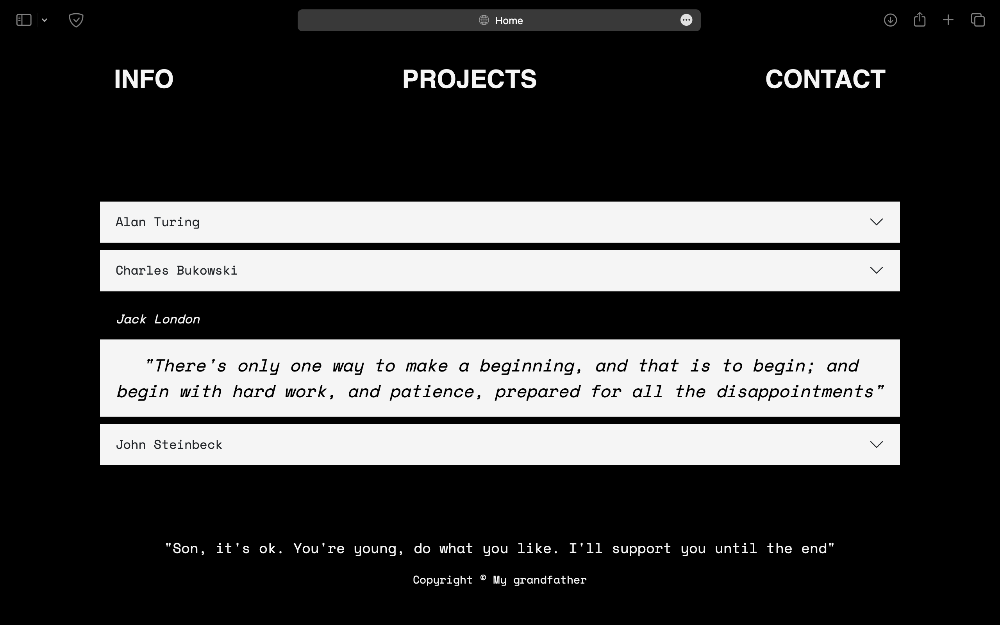
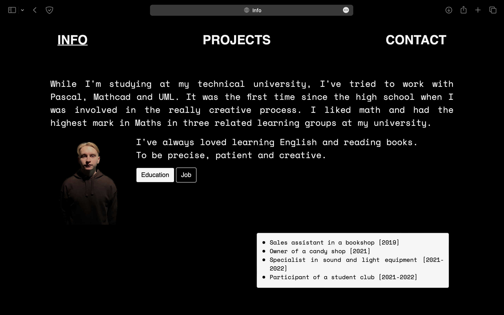
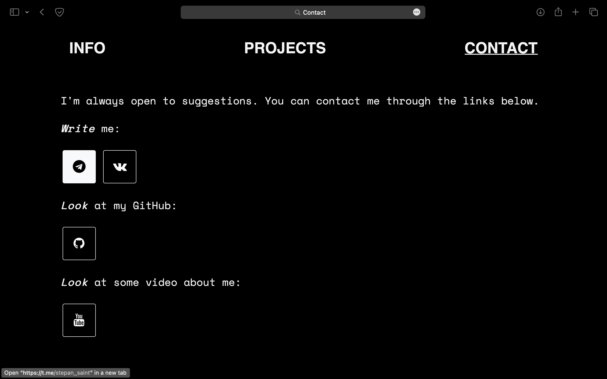
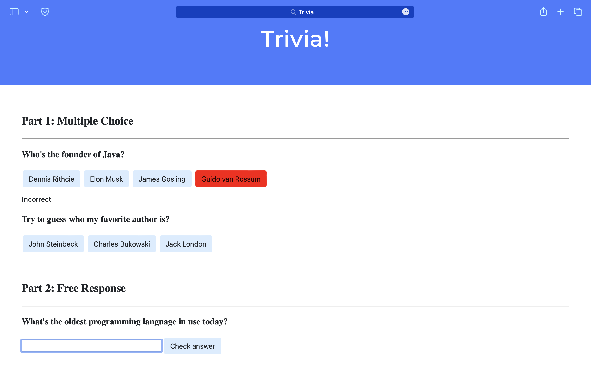

# Usage:
Download Problem Set 8 and open up this folder.

### _From Homepage_ [Task.txt](Homepage/Task.txt)  

Open up folder Homepage.

To *look* at the first web-page: [index.html](Homepage/index.html)

How it looks: 

### _From Lab\_8_ [Task.txt](Lab_8/Task.txt)  

Open up folder Lab_8.

To *look* at the web-page: [index.html](Lab_8/index.html)

How it looks: 

<!-- 

    
    

 -->

_These are all tasks from Week 8. All of them passed CS50 tests._
